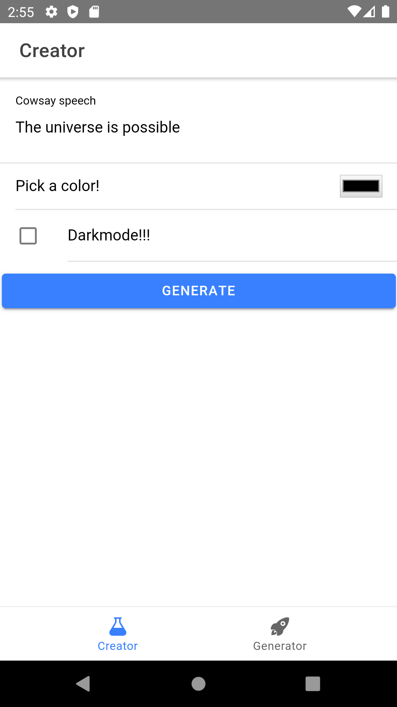
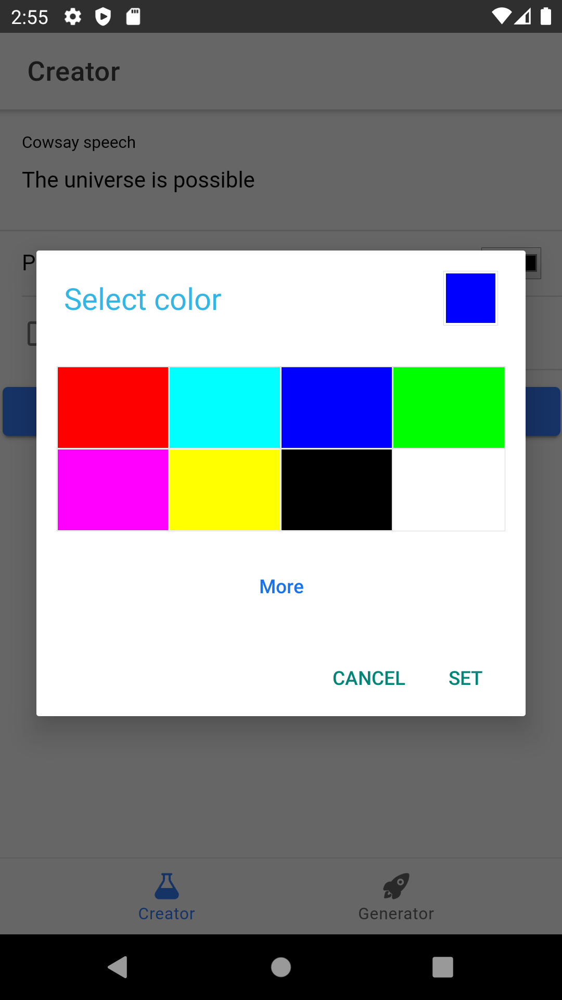
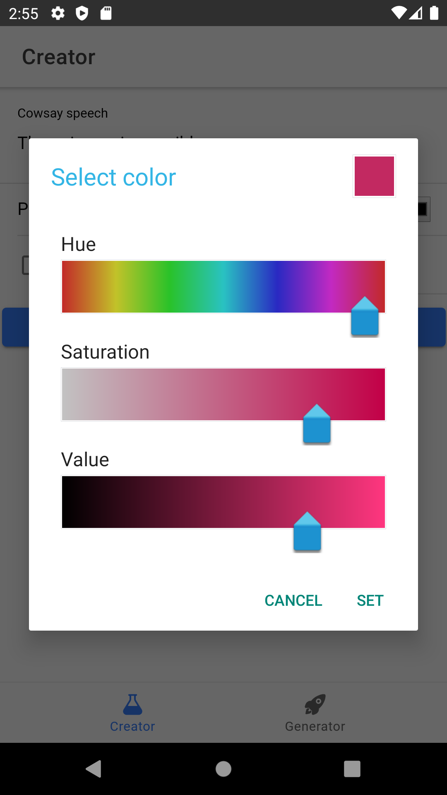
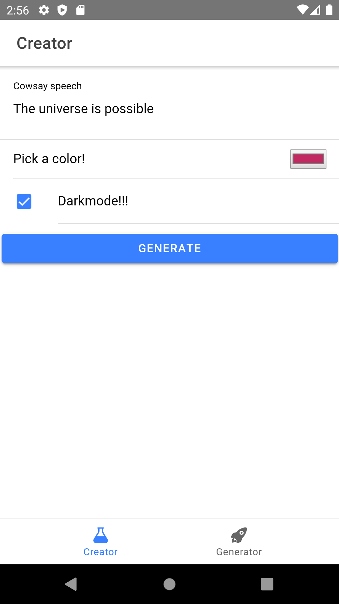
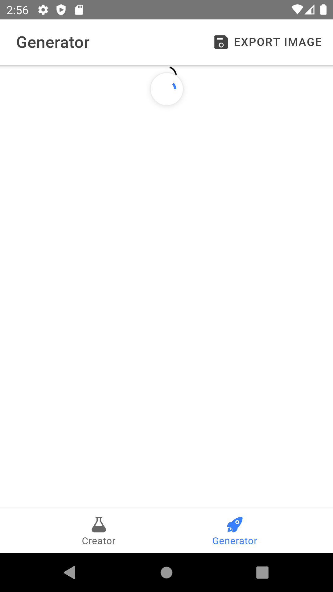
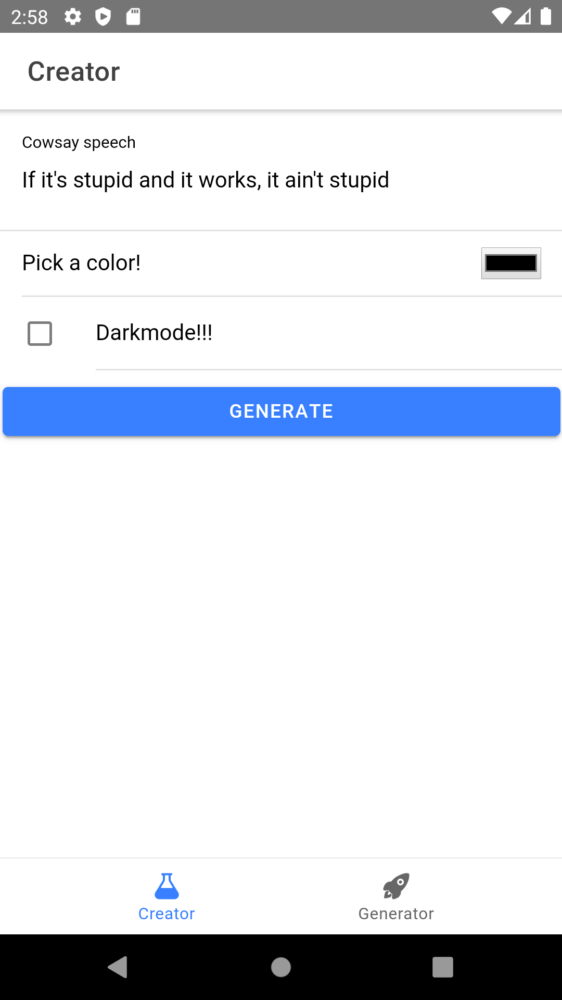
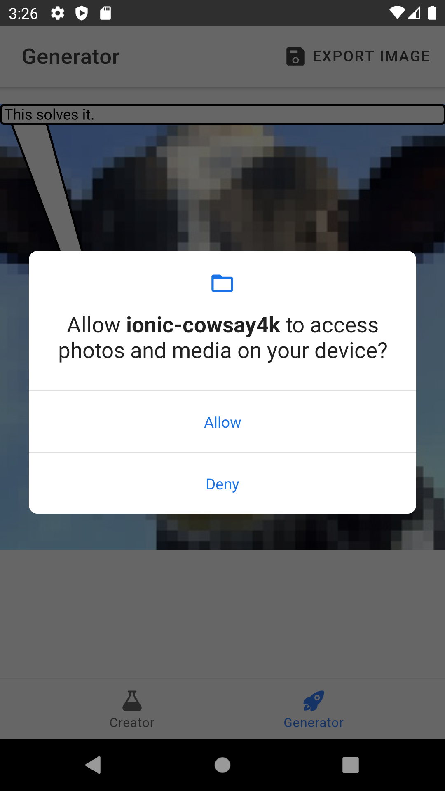
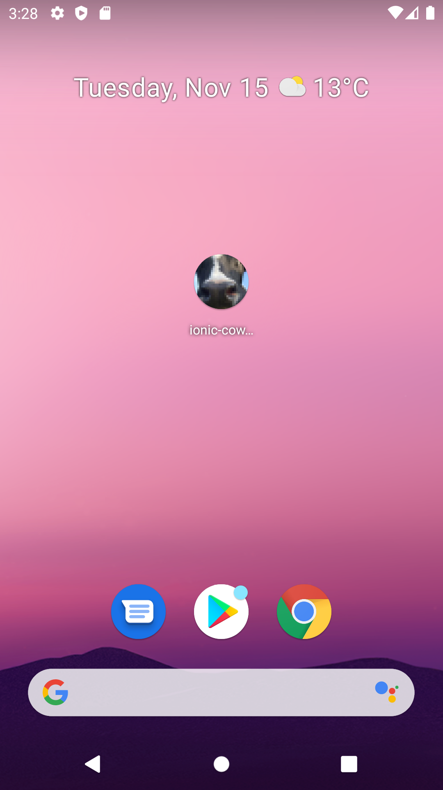

Peter Leconte r0830684 3AD

# Report Cross Development

## Intro

```
 ______________________________
< Cross development with Ionic >
 ------------------------------
        \   ^__^
         \  (oo)\_______
            (__)\       )\/\
                ||----w |
                ||     ||
```

For our second report we will be developing our test case with Ionic.  
For my framework I chose Vue instead of Angular.

We will be creating a coherent UI with Ionic's components, using plugins
(with mocks and fallbacks) to use native features and building our app for 
android.

### Changes in concept

There are no file dialogs anymore to choose where to export a file, this 
because of the lack of plugin support and browser support for this.
Instead it will have default name with a timestamp and place it in a default 
directory.

I also added an indication for the generation of images because Canvas is 
incredibly slow. I tried to optimize it but converting to Base64 is quite
expensive.

## Steps followed

### Start of development

Starting out with Ionic is as simple as installing the cli tool with 
`npm i -g @ionic/cli`.  

You can choose between multiple web frameworks (Angular, React and Vue), whichever
you're most comfortable with.

During development you can easily use ionic's components to create your app,
together with html and css this makes for an easy and fast development process.

### Creating a cross-platform interface

Ionic gives you the tools to create a coherent UI, which will fit the platform
it's deployed on.

### Using a capacitor plugin

In my app I wanted to include 2 plugins: Filesystem API plugin and the vibration
plugin.

Using this plugin easily makes it cross-platform while still using native features.

To use the file system plugin we first have to add it with these two commands:  
`npm i @capacitor/filesystem`  
`npx cap sync`

After that we can use the API in our project.
In `src/common/utils.ts` I use the api as follows:

```ts
import { Directory, Filesystem } from "@capacitor/filesystem";
// ...

export async function saveBlobUrl(blobUrl: string): Promise<string> {
    // ...
    const fileName = new Date().getTime() + "-cowsay.png";
    const savedFile = await Filesystem.writeFile({
        path: fileName,
        data: data,
        directory: Directory.Documents,
    });
    return savedFile.uri;
}
```
Here we can simply use the Filesystem API function writeFile to write a file to our device.
This plugin will then use our device's native OS API to store our file.

In the documentation we can find this:
> The Documents directory On iOS it's the app's documents directory. Use this directory to store user-generated content. On Android it's the Public Documents folder, so it's accessible from other apps. It's not accesible on Android 10 unless the app enables legacy External Storage by adding android:requestLegacyExternalStorage="true" in the application tag in the AndroidManifest.xml. It's not accesible on Android 11 or newer.

As you can see, its behaviour is different depending on its platform.  
Speaking of which, it mentions the android manifests file.

#### Mocking plugins

Native plugins such as vibration and using the filesystem do not work in your 
browser. They're meant to be used on mobile devices such as Android and iOS.

When u use such a plugin you might get a warning in your browsers console but 
that's it.

This is where mocking comes into play.  
With mocking we can pretend that a plugin has different functionality than it 
actually has. This is useful for unit testing but also in our case to either have 
different functionality if it's not a native platform, or to simply tell us 
that it would've happened.

While Vue might not have the same mocking features as Vue does, with Vue we can replicate this mocking behaviour manually with Typescript:
```ts 
// File: src/utils/haptics.ts
// Mock
export class HapticsMock {
    vibrate(_opt?: VibrateOptions) {
        console.log('Vibrating on device');
        createToast('Brrrrr');
        return Promise.resolve();
    }
}

// Factory
let Haptics: HapticsPlugin | HapticsMock;
if (Capacitor.isNativePlatform()) {
    Haptics = HapticsNative;
}
else {
    Haptics = new HapticsMock();
}

export default Haptics;
```

Here we create a mock class which has the functionality we want to change of our 
haptics plugin. In this case only vibration has to be overwritten.

The mock version will simply log in the console when a vibration happened but 
also create a toast saying 'Brrrrr' as a fallback.
This is handy during development with `ionic serve`, since we can see if it 
would've vibrated or not.

Then in the Factory we specify when we would want which behaviour.  
Here we specify that we want the mock version if it is not the native platform.

When we want to use Haptics in our code we simply import our own implementation 
of Haptics. No other boilerplate is needed.
```ts 
generateImage(isGenerating, imgDataUrl, canvas, img).then(async () => {
    await Haptics.vibrate();
});
```

This is not the only place I implemented a mock/fallback. I also implemented
a fallback for exporting images.  
On native devices we have to use the Filesystem plugin while on browsers we 
should use a link with a download attribute.

```ts 
// File: src/utils/save-image.ts
// Mock/fallback
const saveBlobUrlCompat = async (blobUrl: string): Promise<string> => {
    const blob = await fetch(blobUrl).then(r => r.blob());
    const dataUrl = await blobToBase64(blob);

    const link = document.createElement('a');
    const fileName = generateFileName();
    link.setAttribute('download', fileName);
    link.setAttribute('href', dataUrl);

    link.click();
    return fileName;
}

// Native
const saveBlobUrlNative = async (blobUrl: string): Promise<string> => {
    const blob = await fetch(blobUrl).then(r => r.blob());
    const dataUrl = await blobToBase64(blob);
    const data = dataUrl.replace(/^data:image\/\w+;base64,/, "");

    const file = await Filesystem.writeFile({
        path: generateFileName(),
        data: data,
        directory: Directory.Documents,
    });
    return file.uri;
}

async function blobToBase64(blob: any): Promise<string> {
    // ...
}

// Factory
let saveBlobUrl: (url: string) => Promise<string>;
if (Capacitor.isNativePlatform()) {
    saveBlobUrl = saveBlobUrlNative;
}
else {
    saveBlobUrl = saveBlobUrlCompat;
}

export default saveBlobUrl;
```

In this example we mock a single function instead of an entire class.  

### Android

For Android development with ionic we will have to prepare a few things.
For this I will be following the following page:
https://ionicframework.com/docs/developing/android

I simply installed android studio from the [AUR](https://aur.archlinux.org/packages/android-studio)
and followed the steps to install the SDK.

You can also add a virtual device if you want, I will be using my phone with 
usb debugging instead.  
For this I also installed the package `android-tools` so that I had access to
`adb`. With that I can easily load built APK's and check the connected android 
device.

After that's done we have to set some environment variables.

For my system I had to add the following to my ~/.bashrc:
```bash
export ANDROID_SDK_ROOT=$HOME/Android/Sdk

export PATH=$PATH:$ANDROID_SDK_ROOT/tools/bin
export PATH=$PATH:$ANDROID_SDK_ROOT/platform-tools
export PATH=$PATH:$ANDROID_SDK_ROOT/emulator

export CAPACITOR_ANDROID_STUDIO_PATH=/usr/bin/android-studio
```
This may differ for your system, be sure to check where you installed your 
Android SDK.

In my case I also had to add `CAPACITOR_ANDROID_STUDIO_PATH`, otherwise 
I could not start the live reload (see later).

In my project I used capacitor plugins, so for that I have to run the following:  
`ionic capacitor add android`

#### Running with capacitor

After making changes we have to copy the changes again so that changes appear 
on our devices. We can do this with `ionic capacitor copy android`.

After that we can open our project with `ionic capacitor open android`, then
running the project on our device.

We can also use the live reload feature `ionic capacitor run android -l --external`
(make sure you are on the same network). However I prefered building it with 
android studio since the live reload didn't always work properly for me.

#### Android's `AndroidManifest.xml` file

For our Filesystem plugin we actually have to change some permissions and settings
in our manifest file.

In the [documentation](https://capacitorjs.com/docs/apis/filesystem#install),
they mention:
> If using Directory.Documents or Directory.ExternalStorage, this API requires the following permissions be added to your AndroidManifest.xml:
> ```xml
> <uses-permission android:name="android.permission.READ_EXTERNAL_STORAGE"/>
> <uses-permission android:name="android.permission.WRITE_EXTERNAL_STORAGE" />
> ```

Not only that but as shown before they mention: 
> On Android it's the Public Documents folder, so it's accessible from other apps. It's not accesible on Android 10 unless the app enables legacy External Storage by adding android:requestLegacyExternalStorage="true" in the application tag in the AndroidManifest.xml. It's not accesible on Android 11 or newer.

So I added this to my manifest file as well.

## Links to theory lesson

- Mocking

## Screenshots of end result

  
Fresh startup of app, random quote with networking working.

  
  
  
Colorpicker working as expected.

  
Generating the image shows a loading icon

  
Generated image, using the color and text from the service.

  
Exporting an image creates a toast saying where its exported.

  
You can generate the image again by dragging down for a refresh.

  
Another fresh startup of the app, showing another random quote.

  
Multiline generation of text

  
You have to accept permissions.

  
Exported pictures, showing file IO working

  
App icon.

  
Splashscreen.

## Conclusion

## Comparison

## Extra's

- I used Vue instead of Angular

