Peter Leconte r0830684 3AD

# Report Cross Development - Electron and Tauri

## Intro

```
         d888888b  .d8b.  db    db d8888b. d888888b 
         `~~88~~' d8' `8b 88    88 88  `8D   `88'   
            88    88ooo88 88    88 88oobY'    88    
            88    88~~~88 88    88 88`8b      88    
            88    88   88 88b  d88 88 `88.   .88.   
            YP    YP   YP ~Y8888P' 88   YD Y888888P

                         ===???===                     
                     =???????????????=                 
                  =?????????????????????=              
                 ??????????=====??????????             
               =???????=           =???????=           
              =??????                 ??????=          
             =?????=                   =?????=         
             ==                         =?????         
                           =====         ??????        
             =??0?        ???????         ?????        
           ?00000=       ?????????        ?????        
         =0000000=       ?????????        ?????        
        ?000000?=        =???????=        ?????        
      =000000=             ?????=        =?????        
      00000?                             ?????=        
     ?0000?                             ??????         
    =00000          ===               =??????          
    ?0000=        ?00000?=          =???????           
    00000=       ?00000000        ????????=            
    00000        000000000=       ???????              
    00000=       =0000000?       =????=                
    ?0000?        =?0000?        ===                   
    =00000=                                            
     ?00000                      ==??0                 
      ?00000=                  ?00000=                 
       ?00000?=              ?000000=                  
        ?0000000?=       ==?000000?                    
          ?0000000000000000000000=                     
           =?00000000000000000?=                       
              ==?000000000??=                          
```

For my third report I'm doing it differently. I was allowed to make my 
project in Tauri instead of Electron.  
We'll be covering the steps to integrate Tauri into my Ionic project, how 
we can make use of the Tauri API, the Rust backend and the process for building
and cross-building my application.  
Afterwards I will be comparing the two against each other, 
as well as the other options we've seen before.

Tauri is a framework for building lightweight, secure and fast multi-platform 
applications using web technologies, which has a backend in Rust compared to a
backend with Node.js in Electron.

### Changes in concept

For simplicity sake I already converted my images to 4k and png to simplify the 
backend with Rust for generating the images.

I did not find a good easy-to-use image library for drawing that properly supported
the image crate, so I made it a little easier for myself so I could still do it 
in Rust.

Do keep in mind however, that this was optional. The frontend code from previous
project still works fine.

In comparison to my previous project in Ionic, the save dialog for exporting
images is back.

## Steps followed

### Prerequisites

Before we get started, make sure to have all the necessary build tools installed.

https://tauri.app/v1/guides/getting-started/prerequisites

### Integrating Tauri in our existing Ionic project

One of the benefits Tauri and electron have is that we can use our existing web 
project, whether it was made with node (Vue, Angular etc) or Rust (Yew, Dominator etc).

So I decided to use my existing Ionic project and turn it into Tauri application.

Let's make sure we have our tauri cli with `cargo install tauri-cli`.

In the root of our project we can initialize Tauri with `cargo tauri init`.

This will then prompt you with the following questions:
- What is your app name?
- What should the window title be?
- Where are your web assets (HTML/CSS/JS) located relative to the <current dir>/src-tauri/tauri.conf.json file that will be created?
    - Here I set it to `../dist`
- What is the URL of your dev server?
    - This can be the URL you used for `ionic serve`
- What is your frontend dev command?
    - The aforementioned `ionic serve` is what I used here
- What is your frontend build command?
    - You can use `ionic build` just make sure your web assets folder is correct,
    I used `npm run build` which builds with Vue instead

After this our project will look something like this:
```
│── package.json
│── dist
│   ╰── index.html
│── src
│   ╰── ...
╰── src-tauri
    │── Cargo.toml
    │── build.rs
    │── icons
    │── src
    ╰── tauri.conf.json
```

Now we can start developing with `cargo tauri dev`.

### Calling our Rust code from the backend

In our application we might want to write performant code in Rust and call this 
from our front-end.

In my case I wanted to solve the complaint I had about generation being to slow 
due to base64 conversion.

The solution I came up with was generating the image in Rust instead where we 
can make use of multi-threading and more to speed this up. We can also avoid
converting to base64 by writing this to a temporary file instead and loading
the image in our front-end.

But how can we actually call this Rust code from the front-end?  
Let's look at a simple example.

Let's say we want to pass a string to our rust function, do something with it and
return the result to our frontend.

In Rust we can create a function like so:
```rust
#[tauri::command]
fn my_custom_command(invoke_message: String) -> String {
  format!("I was invoked from JS, with this message: {}", invoke_message)
}
```
and we can add this invoke handler to our application like so:
```rust
fn main() {
  tauri::Builder::default()
    .invoke_handler(tauri::generate_handler![my_custom_command])
    .run(tauri::generate_context!())
    .expect("error while running tauri application");
}
```

Then in our frontend we can simply import the invoke function from our Tauri api
package and use it like so:
```js
invoke('my_custom_command', { invokeMessage: 'Hello!' })
```

This return a promise, which we can use like this to get our result:
```js
invoke('my_custom_command', { invokeMessage: 'Hello!' })
    .then((message) => console.log(message))
// or use await
```

Easy!

Now let's see how we can apply this for image generation.

#### Image generation

Alright let's break down this command:

```rust
// src-tauri/main.rs
#[tauri::command]
async fn generate_image(message: String, color: String, state: tauri::State<'_, ImageState>, app_handle: tauri::AppHandle) -> Result<String> {
    let asset = DEFAULT_ASSETS.choose(&mut rand::thread_rng())
        .expect("Slice shouldn't be empty");
    *state.asset.lock().unwrap() = Some(asset);

    println!("Random asset: {:?}", asset);

    let path = app_handle.path_resolver().resolve_resource(asset.path)
        .expect("Asset should exist");

    draw_image(
        state.path.as_path(), path.as_path(), &asset.point,
        message, color
    ).await?;

    Ok(state.path.clone().into_os_string().into_string()
        .map_err(|_| {Error::Generic("Failed to convert path into string".into())}).expect("TEST2"))
}
```

The first thing you might notice is that the function is async. This is so we 
don't block our UI thread while we are generating our image.
This function will get sent to seperate thread.

> Async commands are executed on a separate thread using async_runtime::spawn. 
> Commands without the async keyword are executed on the main thread unless
> defined with #[tauri::command(async)].

In the function we have also 4 parameters.  
The first two are self-explanatory. We simply supply a message and a color
from the frontend. The other two parameters however are unique to Tauri.

The third parameter is a state. With a state we can have data that is shared 
between handlers and the app.
A simple use case for this would for example be to count how many times a handler 
has been called from the frontend.

In our case the state looks like this:
```rust
// src-tauri/src/main.rs
pub struct ImageState {
    path: PathBuf,
    asset: Mutex<Option<&'static ImageAsset>>,
}
```

Which we can define and manage in our Tauri application like so: 
```rust 
// src-tauri/src/main.rs
fn main() {
    // Here we create a state with our temporary file location
    // and an empty asset (the asset hasn't been decided yet)
    let state = ImageState {
        path: { 
            let mut buf = std::env::temp_dir();
            buf.push("crabsay");
            buf.set_extension("png");
            buf
        },
        asset: Mutex::new(None),
    };

    tauri::Builder::default()
        .manage(state) // Here we register our state
        .on_window_event(|event| match event.event() {
            WindowEvent::CloseRequested {..} => {
                println!("Exiting, cleaning up...");
                std::fs::remove_file(event.window().state::<ImageState>().path.as_path());
            }
            _ => {},
        })
        .invoke_handler(tauri::generate_handler![greet, save_image, generate_image])
        .run(tauri::generate_context!())
        .expect("error while running tauri application");
```

After registering our state we can access it inside our handlers.

The fourth parameter is our app handle. We'll use this to resolve paths.

In the body of our function we first choose a random asset from our default 
assets and store it inside our state.  
This way we can access our state later when we want to export an asset.  

> Yes you can also just copy the temporary file but I wanted to play around with states :)

In the next step we resolve our path from our asset.  
We want to have the path of where our asset is stored after building our application
and storing the assets along side it. This function will do that for us, this 
way we don't have to worry about about having the wrong path that only works 
during development, this will take into account where the assets are stored 
relative to our executable.

This is what path resolver does.
```rs
path: "assets/img/ferris.png",
```
This path will get resolved to the path it is stored relative to the executable.

In the next function we then generate our image.

We wait for the result of this function and if any errors occur we simply 
bubble it up and show the error in the front-end.

In the front-end we handle it like this:

```typescript
// src/util/image-generation.ts

export async function generateImage(
    isGenerating: Ref<boolean>,
    imgDataUrl: Ref<string>
): Promise<void> {
    return new Promise<void>((resolve, reject) => {
        isGenerating.value = true;
        imgDataUrl.value = "";

        invoke("generate_image", {
            message: Settings.text.value,
            color: Settings.color.value,
        })
            .then((path) => {
                console.log("Generated path: ", path);
                // Prevent caching of image with timestamp in url to make it unique
                const timestamp = Date.now();
                imgDataUrl.value =
                    convertFileSrc(path as string) + "?t=" + timestamp;
            })
            .catch((e) => {
                createToast(
                    "An error occured while generating an image: " + e,
                    "middle"
                );
                console.error(e);
            })
            .finally(() => {
                isGenerating.value = false;
                resolve();
            });
    });
}
```

We invoke the command with the right parameters. The function returns a simple 
promise so we can set our image path that we get back (simply our tmpfile) and 
change the source of the image.

P.S.: The reason we add a timestamp to the end of our url is simply to make it 
unique from the previous url. This way our renderer knows it has actually changed.

The errors that bubble up from our draw function get a string attached to them:

```rust
// src-tauri/src/error.rs

#[derive(thiserror::Error, Debug)]
pub enum Error {
    #[error("Generic error: {0}")]
    Generic(String),

    #[error("IO error")]
    IoError(#[from] std::io::Error),

    #[error("Raqote PNG encoding error")]
    PngEncoding,

    #[error("PNG decoding error")]
    PngDecoding(#[from] DecodingError),

    #[error("Font selection error (do you have Comic Sans?)")]
    FontSelectionError(#[from] SelectionError),

    #[error("Font loading error")]
    FontLoadingError(#[from] FontLoadingError),
}

impl From<Error> for InvokeError {
    fn from(err: Error) -> Self {
        InvokeError::from_anyhow(err.into())
    }
}
```
and we simply display that error message in a toast.
It's a bit of a lazy way of handling it but works perfectly fine for our usecase.

#### Saving our image

For saving our image we use the same technique. And as an example I also showed
how I used a state for this which I want to talk a bit more about.

As mentioned before we can set our state with the manager function on our 
application builder.

Let's talk about this state in relation to Rust a little more.

#### State with Rust

While working with this state it will likely show you immediately how Rust 
prevents you from making mistakes.

Looking at our state, 2 things stand out.

1. A mutex type
2. An option type

However this is not the case for our path. Why is this?

##### Why the mutex?

When we pass the state to our application Rust keeps us safe from making mistakes.

Our state isn't borrowed as a mutable by Tauri.  
Which makes perfect sense. What if we try to increase a count at the same time 
in multiple commands?  
Or in our case: what if I generate the image but I immediately try 
to export it right after? We might run into a race condition where it tries 
to export previous state of our image, and then generates a new one.  

Rust steps in and simply doesn't allow us to make this mistake.

Instead our state is immutable and we cannot directly alter our state.
We can however use a mutex in our state and modify the mutex.

The compiler won't complain about this because it is not possible to have
2 commands alter the mutex at the same time, they have to wait for their lock.

This way *we know* that our value cannot be changed at the same between 
multiple threads or commands.

Crisis averted, the borrow checker and type safety saves us again!

The term often used for this is "Fearless concurrency", here is a snippet from 
the Rust book:

> #### Fearless Concurrency
> 
> Handling concurrent programming safely and efficiently is another of Rust’s 
> major goals.
> Concurrent programming, where different parts of a program execute independently,
> and parallel programming, where different parts of a program execute at the 
> same time, are becoming increasingly important as more computers take advantage
> of their multiple processors. Historically, programming in these contexts has
> been difficult and error prone: Rust hopes to change that.
>
> Initially, the Rust team thought that ensuring memory safety and preventing
> concurrency problems were two separate challenges to be solved with different
> methods. Over time, the team discovered that the ownership and type systems 
> are a powerful set of tools to help manage memory safety and concurrency 
> problems! ...
- [Rust book - Chapter 16](https://doc.rust-lang.org/book/ch16-00-concurrency.html) 

##### Why the option?

The `Option` type in Rust is a default enum from the standard library which 
covers a very common case where a value may be something or nothing at all.

In the beginning of our program we have not decided a state yet, thus our value 
is `None`, after the first generation it has `Some(asset)`.

The advantage of the `Option` type is simply to remove null values and all the 
problems they bring. It is now very clear whether the value is actually meant to 
be none and we have to handle both cases explicitely in Rust to exhaust all
options.

In our case we exhaust it like so:
```rust
// src-tauri/src/main.rs

    if let Some(asset) = asset {
        let asset_path = app_handle.path_resolver().resolve_resource(&asset.path)
            .expect("Asset should exist");

        draw_image(
            path,
            &asset_path.as_path(),
            &asset.point,
            message,
            color
        ).await?;
        return Ok(());
    }
```

Here we check if asset is `Some`, if it is we take the asset out of it and 
resolve and draw our image with it.

Here is another snippet from the Rust book:

> Programming language design is often thought of in terms of which features 
> you include, but the features you exclude are important too. 
> Rust doesn’t have the null feature that many other languages have. 
> Null is a value that means there is no value there. 
> In languages with null, variables can always be in one of two states:
> null or not-null.
> 
> In his 2009 presentation "Null References: The Billion Dollar Mistake," 
> Tony Hoare, the inventor of null, has this to say:
> 
>> I call it my billion-dollar mistake.
>> At that time, I was designing the first comprehensive type system for
>> references in an object-oriented language. My goal was to ensure that all
>> use of references should be absolutely safe, with checking performed 
>> automatically by the compiler. But I couldn’t resist the temptation to put
>> in a null reference, simply because it was so easy to implement. 
>> This has led to innumerable errors, vulnerabilities, and system crashes,
>> which have probably caused a billion dollars of pain and damage in the last forty years.
> 
> The problem with null values is that if you try to use a null value as a 
> not-null value, you’ll get an error of some kind. 
> Because this null or not-null property is pervasive, it’s extremely easy to
> make this kind of error.
> 
> However, the concept that null is trying to express is still a useful one:
> a null is a value that is currently invalid or absent for some reason.
- [Rust book - Chapter 6 on advantages of the Option Enum over Null values](https://doc.rust-lang.org/stable/book/ch06-01-defining-an-enum.html#the-option-enum-and-its-advantages-over-null-values)

### Using the Tauri API

In our application we use the Tauri API for 3 things:

- Invoking commands (as seen before)
- Opening a file dialog to get a valid save location for an image
- Using the asset protocol

Tauri's philosophy is a little different from Electron's so for most things in 
the configuration the default in the allowlist is set to false.

This is not only for security (which is already a big one) but also for a reduced
bundle size.

`src-tauri/tauri.conf.json`:

```json
    ...
    "tauri": {
        "allowlist": {
            "all": false,
            "protocol": {
                "all": false,
                "asset": true,
                "assetScope": ["$TEMP/crabsay.png"]
            },
            "dialog": {
                "all": false,
                "save": true
            }
        },
        ...
```

Here for our asset protocol we first enable it and then define the scope.
The more specific you can make it, the better.
In our case we specify a file named inside of our OS's temperary folder
named crabsay.png, it won't be named anything thing else or placed elsewhere.

```typescript
// src/util/image-generation.ts

import { convertFileSrc } from "@tauri-apps/api/tauri";

...
imgDataUrl.value = convertFileSrc(path as string) + "?t=" + timestamp;
```

`convertFileSrc` takes a path and converts it to a uri using the asset protocol.

For our dialog we only want to enable the save dialog, it's the only one we use.

For our save dialog we can use the save function:

```typescript
// src/util/save-image.ts

import { save } from '@tauri-apps/api/dialog';

async function exportImage() {
    const filePath = await save({
        filters: [{
            name: 'Image',
            extensions: ['png']
        }]
    });
    
    if (!filePath) return;
    ...
```

This will open a save dialog where you can only select a save location
ending in png.

### building our tauri application

#### Preparing our build

Before actually building our application there are a few things that we have to do.

First up we have to declare our beforeBuildCommand. Similar to our beforeDevCommand
(which is set to `ionic serve`) we have to define what will build our frontend.  
The place where this then gets built has to be our distDir as well.

This was set when integrating Tauri earlier, you can change these settings in 
the tauri configuration file.

As for configuring Vue, we have to set a relative public path:

```js
module.exports = {
    publicPath: "./",
}
```

and then also change our routing to this (thanks Dries :D, Ionic is weird):

```ts
// src/router/index.ts

const router = createRouter({
  history: createWebHashHistory(process.env.BASE_URL),
  routes
})
```

Our custom resources for images also need to be included (this way they will be
present together with our executable).

Simply add `"resources": ["assets/**"]` to your bundle tauri configuration.

When running in dev mode it's actually running the 
`ionic serve` command. Tauri has no control over it's `CSP` settings.

However, in build this *is* properly applied and so we might run into a couple
of issues:

- Our request to whatthecommit isn't working
- Not all our styles are properly working
- Not even our own image asset is working!

What gives?

Well we have to set our csp settings to something like this:
```json
"security": {
    "csp": "default-src 'self' https://whatthecommit.com/index.txt; img-src 'self' asset: https://asset.localhost; style-src 'self' 'unsafe-inline'"
},
```

Content Security Policy (CSP) is very important. It's an added layer of security
that helps to detect and mitigate certain types of attacks including Cross-Site
Scripting.

In those lines we define that we can make request to the whatthecommit site,
to our own asset protocol and our inline styles.

Alright, after all that is dealt with, let's get buildin'!

#### Building for our native toolchain

Building for our native toolchain is as easy as running `cargo tauri build`.

On Linux this will build a .deb file but also an AppImage.  
On Windows we will get a proper msi installer that we can distribute.  
On MacOS we will get an Application bundle (`.app`) or an Apple Disk Image
(`.dmg`).  

#### Crossbuilding

The easiest way to cross-build Tauri is with Github actions.

On Github you can define a workflow which with use the Tauri action to create
all bundles for Linux, Windows and MacOS and put it up as a release.

This CI/CD pipeline can also be used to check if your application builds on
all platforms when u make changes or create PRs.

Let's take a look at Github workflow I used (`.github/workflows/release.yml`):

```yaml
name: Release
on:
  push:
    tags:
      - 'v*'
  workflow_dispatch:

jobs:
  release:
    strategy:
      fail-fast: false
      matrix:
        platform: [macos-latest, ubuntu-20.04, windows-latest]
    runs-on: ${{ matrix.platform }}
    steps:
      - name: Checkout repository
        uses: actions/checkout@v3

      - name: Install dependencies (ubuntu only)
        if: matrix.platform == 'ubuntu-20.04'
        # You can remove libayatana-appindicator3-dev if you don't use the system tray feature.
        run: |
          sudo apt-get update
          sudo apt-get install -y libgtk-3-dev libwebkit2gtk-4.0-dev libayatana-appindicator3-dev librsvg2-dev

      - name: Rust setup
        uses: dtolnay/rust-toolchain@stable

      - name: Rust cache
        uses: swatinem/rust-cache@v2
        with:
          workspaces: './src-tauri -> target'

      - name: Sync node version and setup cache
        uses: actions/setup-node@v3
        with:
          node-version: 'lts/*'
          cache: 'npm' # Set this to npm, yarn or pnpm.

      - name: Install app dependencies and build web
        # Remove `&& yarn build` if you build your frontend in `beforeBuildCommand`
        run: npm i # Change this to npm, yarn or pnpm.

      - name: Build the app
        uses: tauri-apps/tauri-action@v0

        env:
          GITHUB_TOKEN: ${{ secrets.GITHUB_TOKEN }}
        with:
          tagName: ${{ github.ref_name }} # This only works if your workflow triggers on new tags.
          releaseName: 'Crabsay v__VERSION__' # tauri-action replaces \_\_VERSION\_\_ with the app version.
          releaseBody: 'See the assets to download and install this version.'
          releaseDraft: true
          prerelease: false
```

1. This workflow triggers when we push a tag that starts with 'v'
1. We specify the platform targets
1. The workflow will install all the needed dependencies
1. Rust setup and caching
1. Sync the node version and cache
1. Install all app deps and build frontend (in our case building is already 
inside our config with beforeBuildCommand)
1. Build our Tauri app with Tauri action and create a draft release on github
with all the assets

After push our tag we will get an action running and hopefully on success 
you'll get this:
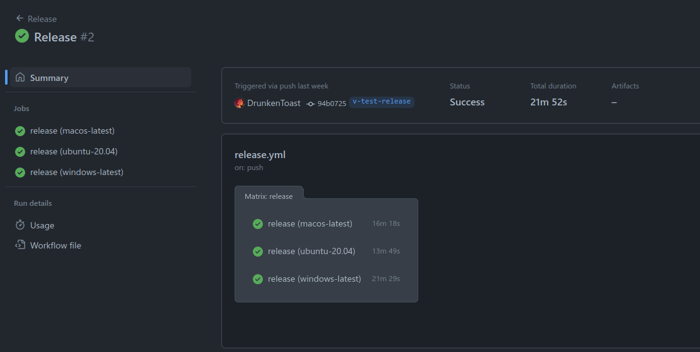

It will also create a release (draft):
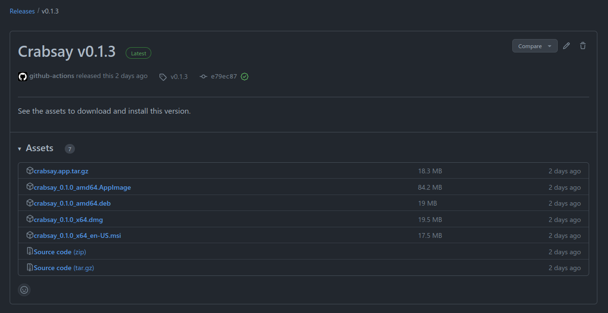

### Mobile support?

Yes! Mobile support is currently in alpha testing.

https://tauri.app/blog/2022/12/09/tauri-mobile-alpha

## Comparison

| Platform | Performance | Development time | Native UI components | Mobile support | Security | Size |
|---|---|---|---|---|---|---|
| Qt | Fastest | Slowest | Yes | When Android SDK is implemented | Best | Small |
| Ionic | Slower | Faster | Yes | Yes | Worse | Highly depends on used frameworks, the platform and plugins |
| Electron | Slower | Faster | Not included | No | Worst | Huge |
| Tauri | Faster | Slower | Not included | Yes (alpha) | Better | Small |

### Performance

With our Tauri app we generate the image on the backend in Rust and save the image 
to a temporary directory. With this we can leverage multithreading from Rust and
we also don't have to decode our image to base64. This ends up being noticeably
faster.

The backend in Rust allows us to leverage powerful and fast code which we otherwise
wouldn't have been able to do in just javascript.
But it is important to keep in mind that we still *have* the javascript too.  
The image generation code from our Ionic project still works perfectly fine,
but now we were able to leverage Rust to make it faster.

> There is some overhead in calling to the backend, so sometimes it is faster to simply
> use javascript in the frontend instead of doing it in Rust.

This wouldn't hold true for Electron, as both the frontend and backend are 
javascript on the V8 engine.  
Tauri outperforms Electron in terms of performance with Rust, launch time and
memory consumption.

(One thing to note is that for the renderer and frontend JS, Electron might beat
Tauri depending on which webview is used.)

We also have to keep in mind that the Rust backend is still seperate from the 
Javascript, our website *itself* won't be any faster.

For example QPainter's speed to draw in our application itself will not be
matched by any other of the platforms we used and the ease of use of the API
may not be underestimated either.

So while Qt still takes the performance crown, Tauri is a force to be reckoned
with as well.

### Development time

Development time for Ionic is lower than for Qt for multiple reasons.  
Ionic is mostly just web development. This means one team can work on it and you 
don't have any fragmentation. While with Qt, styling for android devices is seperate
from desktop which means multiple teams might be needed to maintain the project.

I would also argue that creating a UI with web technologies is easier than with 
Qt, especially if you want to create brand specific styling (outside of native 
components). It will also be easier to find people good at designing websites
compared to Qt designers as it is way more specific.

Development time for Tauri gets tricky.  
Web development stays the same, we can use our familiar html, css and even 
javascript for our frontend.
However, our backend is in Rust rather than javascript for 
Electron.

Two different languages does cause fragmentation.
However the easy-to-use API does somewhat make up for it (for example: 
opening dialogs, using the HTTP API, accessing the clipboard, sending
notifications ... all don't require the use of Rust and are simply an API in 
Javascript).

I would argue that Rust is more difficult than Typescript, and since it's a young
language we have to take learning into account as well :).

Maturity is an important issue to mention as well but not one I am concerned with.  
Rust is a relatively young language and this might cause some lack of crates 
(libraries). 
For example for drawing on top of images, I ended up finding a crate meant for 
drawing on top of targets such as windows or bitmaps.

However, I did not find a clear way to convert a loaded image from the image crate 
to a drawtarget of another library.
Luckily, the drawing crate did have an example using a pngdecoder but having an 
easy to use library which abstracts such things is nice to have.

Given time, it is possible that the drawing crate will add the image crate 
as an optional feature for example.

The lack of such maturity in libraries might impact development time and 
maintainability.

As for Tauri itself, it's young and issues are expected but its future looks 
very bright to me (especially alpha mobile support has me excited).  
I am not concerned with this issue because of all the attention and popularity
Rust and Tauri have been getting. This will automatically be solved given time.

It is also very clear to me that Qt is a very mature platform with
a well defined and easy-to-use API.

A few notible mentions for development time with Tauri are:
- Cross-building is very easy with the Github Action
  - Windows bundle comes with a .msi installer ready to use
- Tauri provides an auto updater
- Tauri is "truly" cross-platform, having support for both desktop and mobile 
(alpha) platforms
- Using the system's webview comes with the obvious benefit of bundle size 
but it might also cause specific problems with compatability 
(and in general bugs and sometimes workarounds are needed)
  - For example: the webview used on linux has a bug where the colorpicker allows 
  transparancy (which should not be the case) which crashes the renderer if picked
  and this bug does not happen in other webviews.

### Native UI components

Both Qt and Ionic offer native UI components. Allowing to easily create a UI 
which will fit on the end users device's theme.  
They are adaptive, meaning they will change depending on the platform.

Electron and Tauri both don't offer UI components themselves but nothing stops
you from using Material or even Ionic in your application.

In fact, Ionic works well together with Electron and Tauri allowing you to 
easily keep your design on mobile and on desktop as well (no development time was lost for 
the frontend when integrating Tauri) but also use the plugins when building 
for mobile.

You can simply build it with Ionic for your mobile platforms and use Electron 
for desktop.

### Mobile support

Ionic supports android by simply wrapping your project in a simple 
webview project (and maybe a sprinkle of plugins from Cordova/Capacitor).  
And since it's mostly web technology, PWA's are also supported.

With Qt you will have to implement the Android SDK or iOS port yourself and
might need to alter code and styling to get it working properly on all devices.

Electron is made for desktop and does not support mobile, however like I 
mentioned before Ionic is a great match together with Electron/Tauri.

Tauri however does have (alpha) support for mobile. Which is great for 
maintaining one project that is cross-platform for all desktop and mobile
platforms.

### Security

Ionic creates hybrid apps and hybrid apps by nature are at higher risk than 
native apps.  
They have security vulnerabilities unique to the programming language,
vulnerabilities that affect the used web browser *and* those that affect native 
apps. This is because hybrid apps still use the webview along with native code.

Compared to Qt we aren't susceptible to browser vulnerabilities, just our native 
code and programming language.

Now let's compare Tauri with Electron.

#### Tauri vs Electron

One of the biggest philosophy shifts between Tauri and Electron has to be the
their opt-in method for features.

In Electron you get may get warning if you don't use the recommended security 
settings, in Tauri it won't work and you will get an error since by default 
everything is set to false.

In essence this means that in Tauri you are meant to incrementally add the
features you need (not only for security but also for bundle size).

Tauri is designed with security in mind (but that does not mean there won't be
any security vulnerabilities).

Let's cover some of the ways Tauri hardens their [security](https://tauri.app/v1/references/architecture/security).

##### Security hardening

First of all, no server is required. You are able to communicate with your backend 
without having to make any network requests. This means that no traffic can 
be sniffed since it isn't there.

This backend is also written in a Rust, a language known for memory safety and 
speed.

Common security vulnerabilities Rust prevents are:

1. Buffer overflows (an attempt to write more data to a buffer, this can overflow, 
potentioally leading to executing arbitary code), dangling pointers 
and other common memory safety issues.
1. With ownership and lifetimes Rust ensures that data is only accessible when 
it is needed and that it is automatically cleaned up, reducing the risk of 
memory leaks and data races.
1. The strong type safety helps prevents type confusion and other types of 
type-based vulnerabilities.
1. Rust provides mechanisms to work with [uninitialized memory](https://doc.rust-lang.org/nomicon/uninitialized.html)
in checked (safe) ways.
1. There are no Null pointers in Rust, instead of Null the Option type is used 
instead. This helps prevent null reference vulnerabilities.

However, it is important to note that no programming language eliminates all 
security vulnerabilities.

By default Tauri uses a dynamic Ahead of Time compiler that generates code 
references that are unique for every session and yet are technically static code
units. AOT compilers can help prevent security vulnerabilites by allowing the
compiler to perform checks and optimizations as well as making it harder to 
reverse engineer or modify the program.  
Decompilation is difficult, which isn't the case with Electron ASAR files.

Javascript code might be minimized but it is still an interpreted language, Rust 
will be compiled which is harder to reverse engineer on its own.

Tauri also does function hardening.  
By using functional address Space Layout Randomization techniques function 
names are randomized at runtime and can implement OTP hashing. This prevents
static attacks since no two sessions have the same unique ID for each function
pointer. With the API you can request such an endpoint, which will return 
a promise wrapped in a closure that Rust injects at runtime in the webview.  
After the promise resolution the handler will be nulled.

This bridge method means that unsafe functions aren't served like Electron 
might do.

Not only that but it's also possible to encrypt messages with a OTP salt between 
the UI and the Rust backend.

Compared to Electron, Tauri also takes an opt-in approach to it's API.  
If it's not enabled, it simply won't be shipped. This reduces bundle size but 
also it's attack surface.  
Since they are opt-in you have to consciously choose what you add to your project
while you work on it.  
In Electron what you serve in your Context Bridge is your responsibility and 
can contain all dangerous electron/node API calls. These calls should be safely
wrapped.

Opt-in might cause friction during development but it is well worth the benefits.

As mentioned before, Tauri injects Content Security Policies. This is an added 
layer of security which may prevent attacks such as Cross-Site Scripting.  
Tauri injects these policies in the index.html file of the UI and when 
using a localhost server, headers are also sent to the UI or any other clients 
connected.

Properly setting this SCP is important for security.

##### Electron's checklist

The [Electron docs](https://www.electronjs.org/docs/latest/tutorial/security)
(16/12/2022) lists a few steps to follow to improve the security of your
application.  
Let's compare this list with our current Tauri application:

1. **Only load secure content**

This is still good advice that should be followed, even for Tauri applications.

You can also use the Tauri HTTP API which uses the Rust client for HTTP.  
For this you need to enable it in the allowList and then you can as recommended
set a scope with only secure content in it.

2. **Disable the Node.js integration in all renderers that display remote content**

The Rust backend is already separated from the frontend.  
The configuration of Tauri also minimizes it's attack surface for such issues
to occur.

This separation has the added benefit of making it clear when you are working
with the Rust backend.

3. **Enable context isolation in all renderers**

The Rust backend is already seperated from the renderer processes, this 
provides strong isolation.

4. **Enable process sandboxing**

Tauri is inherently sandboxed. The frontend has to communicate with the Rust 
backend through IPC. The frontend (UI, renderer processes) and Rust backend are 
seperated.

What is allowed and what is not allowed is defined through it the Tauri 
configuration file and the commands that are registered in the Rust code.

5. **Handle session permission requests from remote content**

These permissions are handled with the configuration allow list.  
By default these are denied.

This does show one of the weaknesses of Tauri.  
Tauri uses different webviews depending on the platform. While this has 
benefits (such as bundle size), on of the downsides might be missing features, 
in which case, this becomes an upstream issue which you might have to wait for.

6. **Do not disable webSecurity**

It is recommended to only enable features as you need them and to properly set 
your scopes. Tauri works with an opt-in system for features.

It is indeed not recommended to disable security.

7. **Define a Content-Security-Policy and use restrictive rules (i.e. script-src 'self')**

By default you have to define a CSP; otherwise you might encounter issues with 
your build.  
However the advice to not set it to '*' obviously still holds true and
is sound advice.  
Only allow what is necessary for your application.

8. **Do not enable allowRunningInsecureContent**

If your CSP is properly set, this will be prevented from loading in your app.

However, looking point 13: it's still possible to make a link that navigates to 
an insecure website.

9. **Do not enable experimental features**

Not using experimental features is also sound advice for Tauri (although
not exactly comparable to Chromium but other features such as 
the recently announced Mobile support for example).  
It's not ready for production use and might not be tested well enough for 
security.

10. **Do not use enableBlinkFeatures**

These features are specific to Chromium. Tauri uses a variety of 
webviews, so this is not relevant.

11. **<webview>: Do not use allowpopups**

Dynamic window creation is disabled by default.  
Like any feature in Tauri and Electron, it's best not to enable if not needed.

12. **<webview>: Verify options and params**

These options can be verified in one central location, your configuration file.  
It is always important to verify your choices and enabled features; to enhance 
security.

It is also important to revisit your past choices and make sure if they are 
still needed. For example during development you might have temporarily made
your scope too large and it can be made smaller.

13. **Disable or limit navigation**

This is still necessary in Tauri if you want to prevent this.
It is still possible for an attacker to 
convice your app to navigate away from it's origin.

There is no built-in system for this yet, however if you know Rust and [ffi](https://doc.rust-lang.org/nomicon/ffi.html)
well you can implement this with webview bindings.

14. **Disable or limit creation of new windows**

Like point 11, creation of windows is turned off by default.

15. **Do not use shell.openExternal with untrusted content**

This advice is also sound for Tauri.  
In the Rust backend it is possible to use the shell. As with all things,
input validation and sanitation is important. If possible to avoid, definitely
do as untrusted content with the shell may be a huge security vulnerability
(leveraging it for executing arbitrary commands).

16. **Use a current version of Electron**

This is true for any piece of software, also Tauri but not only that but in 
general the dependencies you use for your project. Make sure it's up-to-date
for the latest security patches.

17. **Validate the sender of all IPC messages**

Tauri has multiple methods of hardening functions as mentioned before, which 
makes abusing this bridge incredibly hard.

### Bundle size

It's a small one (hah) but I do want to talk about it.

One of the main selling points of Tauri is it's small bundle size.  
This is because they don't bundle an entire webview along with the executable 
while Electron includes a complete instance of Chromium.
This results in a huge cut in size (it can be less than 600kb).

Depending on the features you exclude from your configuration file in Tauri
the bundle size will get smaller.

You can look at some of the benchmarks [here](https://tauri.app/v1/references/benchmarks).

Compared to Qt, Qt will likely result in a smaller executable but this 
depends on what you use and how you build your application.

## Links to theory lesson

- How Tauri works (and Electron by comparison)
- IPC between UI and Rust backend
- Combination of Ionic
- Sandboxing and isolation with webviews and the Rust backend
- XSS and RCE is covered
- Electron security and its checklist
- Asar, used to bundle your app resources, is not hard to decompile compared to 
Tauri
- All 3 icons are present in the src-tauri/icons folder
- Cross-building is done with Github Actions
- Tauri Github action creates the following packaging formats: tar.gz, AppImage,
deb (Linux), dmg (Apple), msi (Windows)

## Conclusion

In this report we compared Tauri to Electron and other frameworks as options 
for multi-platform deployment and evaluated the benefits and drawbacks of each 
option.

Tauri offers a number of benefits as an alternative to Electron, including a 
focus on a focus on security, performance, bundle size and the ability to 
use Rust on the backend. The documentation and easy-to-use API made it fun
to work with, and the tools and documentation provided by Tauri are incredible
(e.g. cross-building with Github Actions).  
However, the potential drawbacks of Tauri, such as compatibility issues,
lack of some features, being an immature project and the need to maintain
an additional language in the project are important to keep in mind.  
For example: during development, I encountered an upstream issue with 
Webkitgtk's color picker and some features like camera permissions may not work
consistently across all platforms, these issues may be detrimental to your project.

Despite these drawbacks, Tauri's emphasis on security, performance, and bundle 
size make it a worthwhile option for projects that prioritise those features.
In addition, Tauri's community is welcoming and helpful, continually improving
the project, giving it a promising future, including the addition of mobile 
support in the near future.

Overall, based on the benefits and drawbacks of Tauri and Electron, I recommend 
considering Tauri as an alterative to Electron if security, performance, and/or 
bundle size are priorities for your project.

I had a blast working with Tauri and I am looking forward to its bright future.

The download is available at:  
https://github.com/DrunkenToast/crabsay-tauri/releases

P.S. Thanks for giving me the oppurtunity to work with Tauri!

## Extra's

- Used Tauri instead of Electron
- Converted my image generation code to Rust for a performace gain
  - Extra because the code in the frontend still worked fine

## Screenshots of end result

### Linux

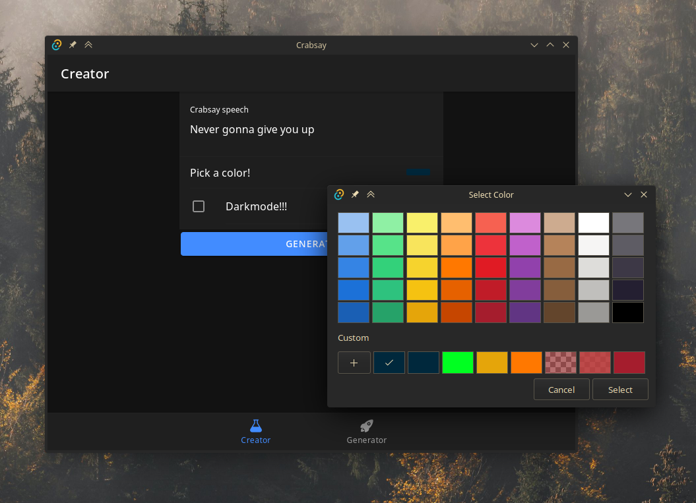  
First startup with the color picker open.

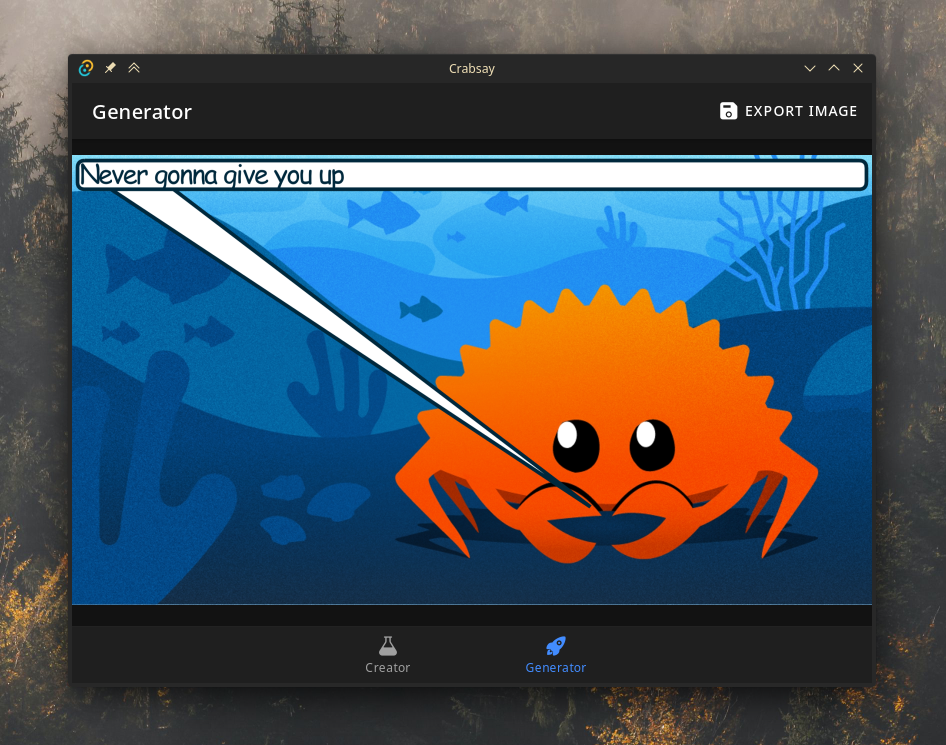  
Generated image with Rust backend.

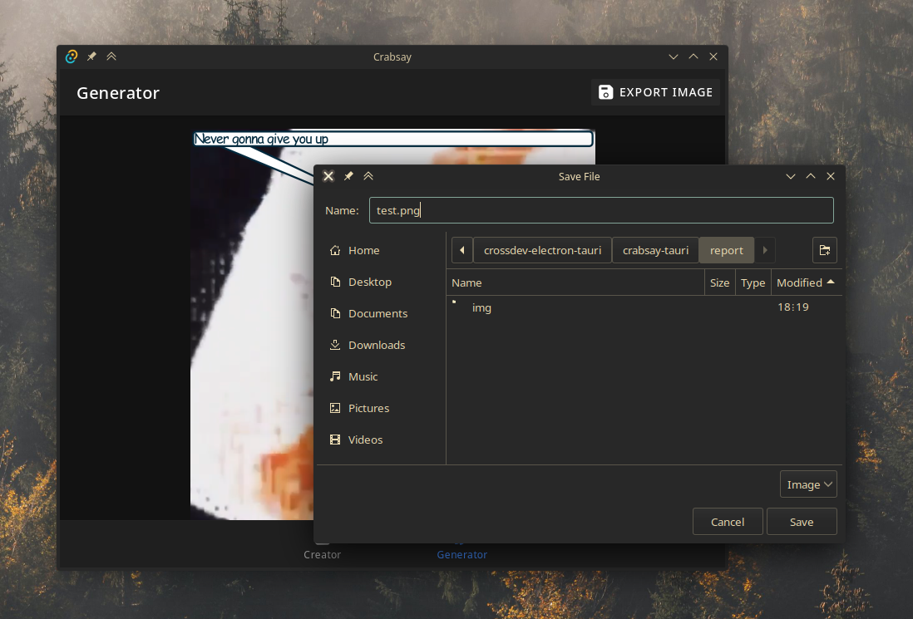  
Save dialog for exporting the image

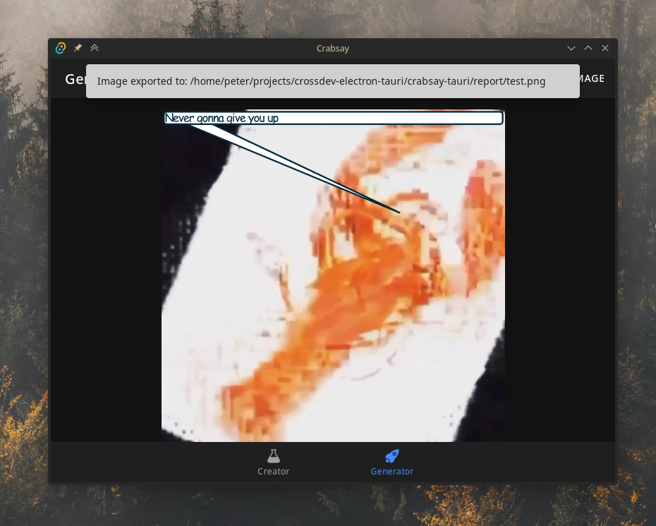  
Confirmation from Rust backend that the image is exported.

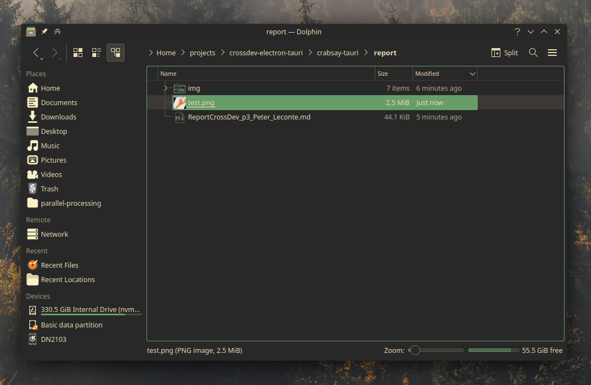  
Succesful file IO

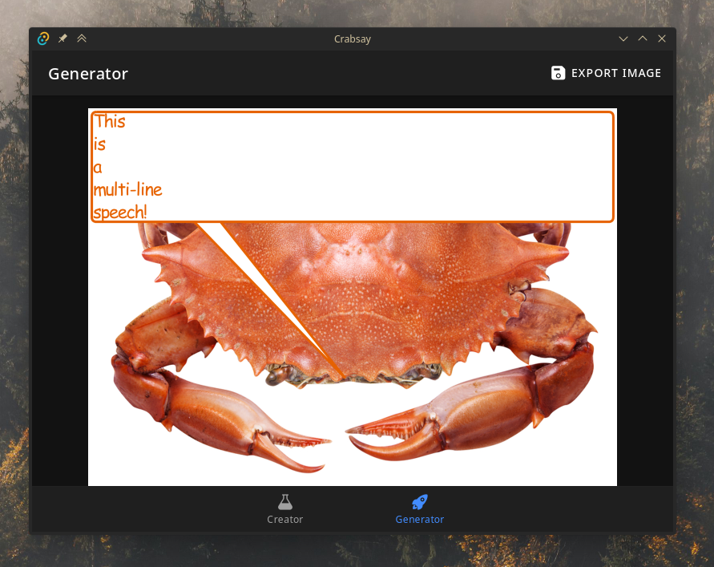  
Multi-line speech text working, as well as random images

### Windows

#### Installer

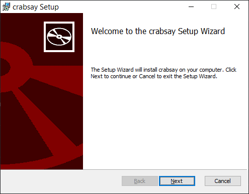  
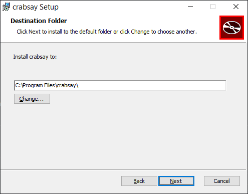  
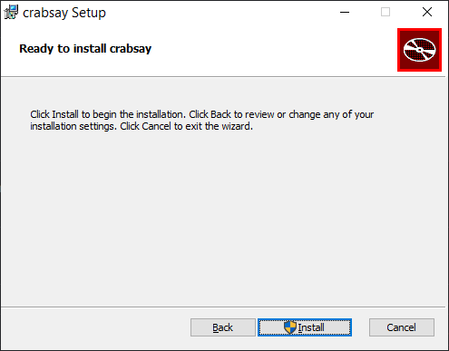  
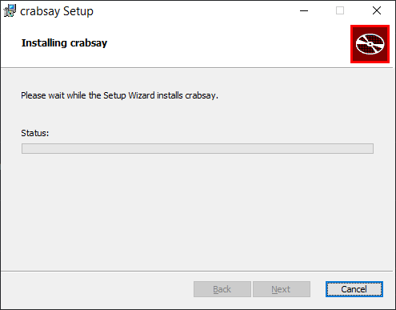  
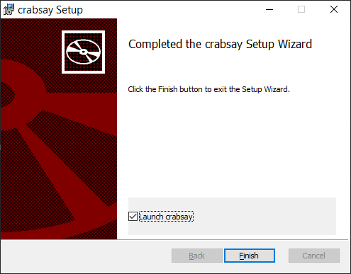  

#### Application

Screenshots are from a *slightly* outdated version

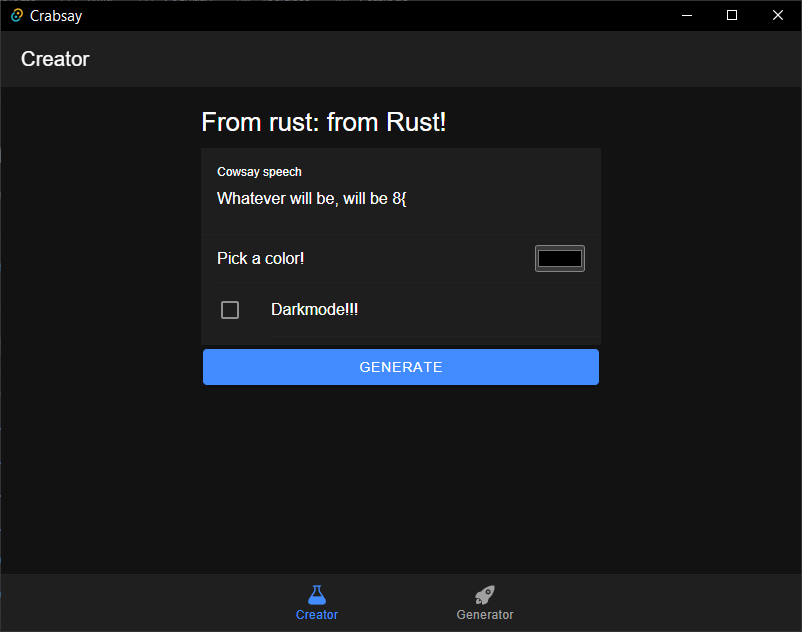  
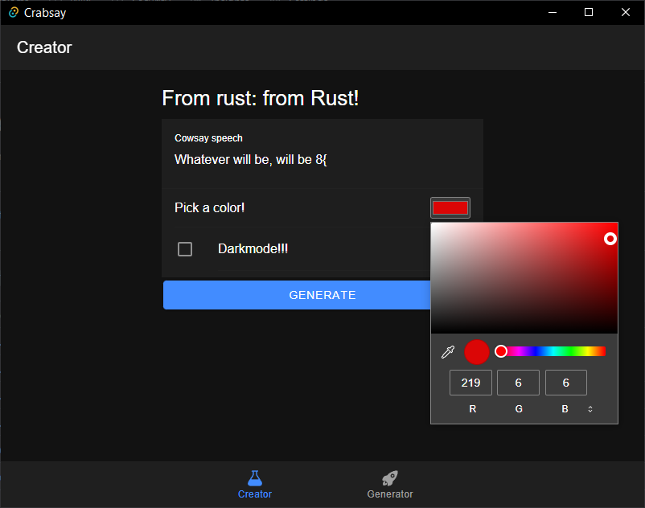  
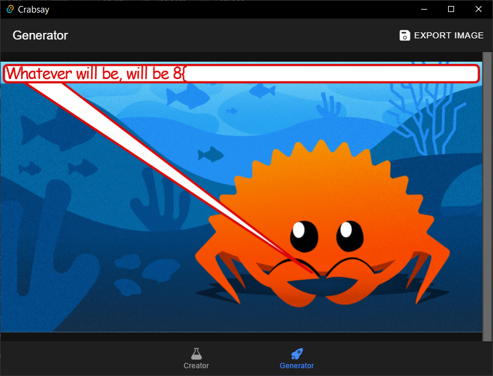  
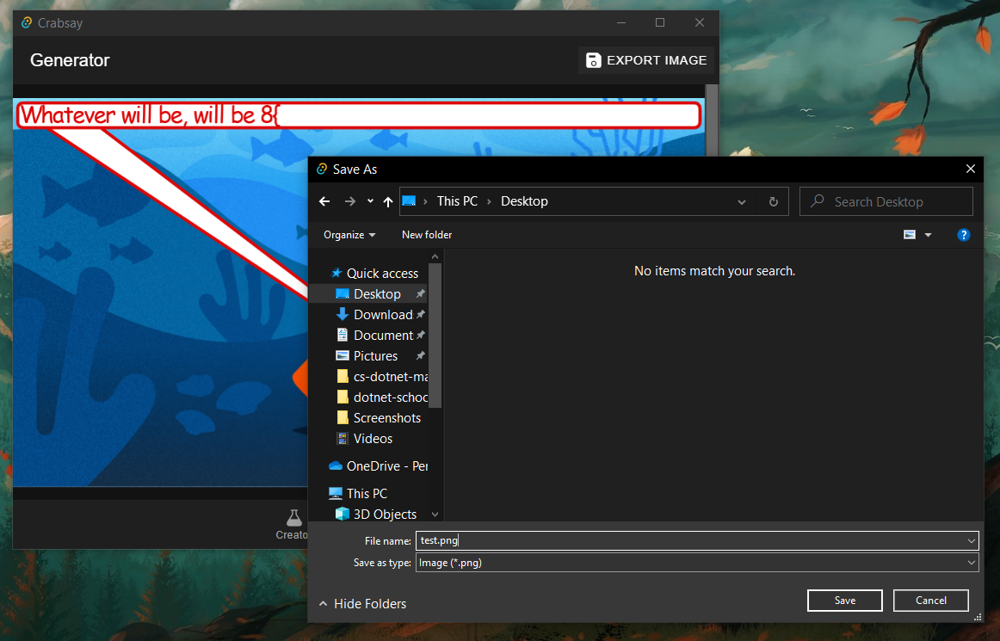  
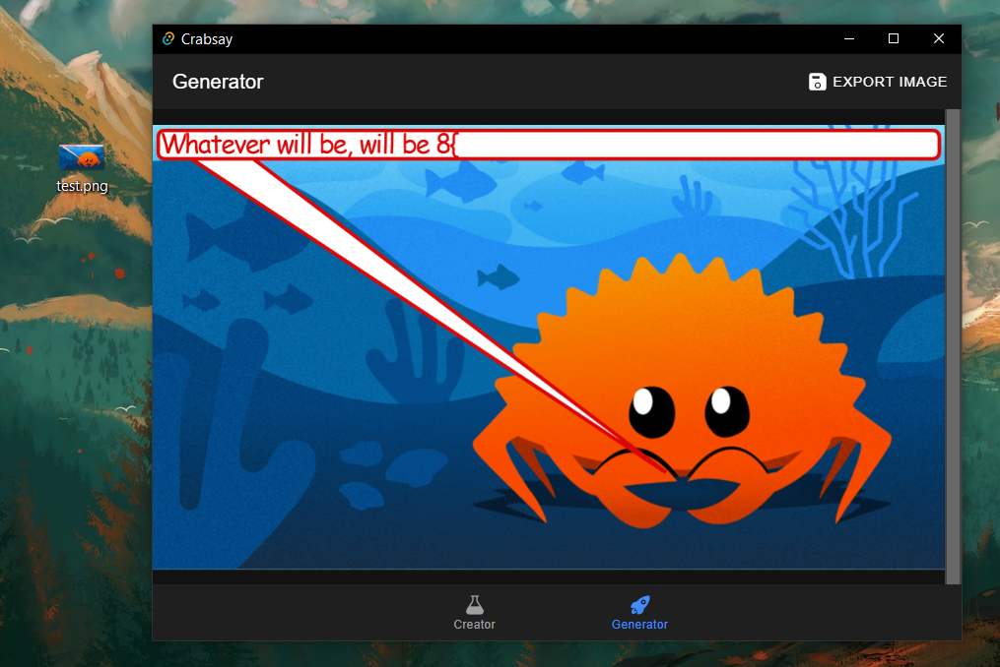  

### Github


Github action finished building

  
Github release with multiple platforms available for download

