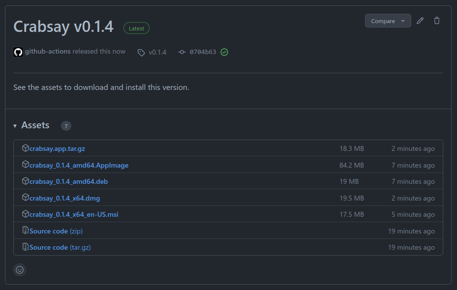

Peter Leconte r0830684 3AD

# Report Cross Development - Electron/Tauri

## Intro

```
                                           .      ╖,                                                
                                          ╫╫▓µ  ┌▓╫╫╖  ,@╫▓                                         
                                   ╞╫╫@, ╓╫╫╫╫@@╫╫╫╫╫@@╫╫╫╫@ ,╗▓╫▓                                  
                             ╓╗╖   ▓╫╫╫╫╫╫╫╫╫╫╫╫╫╫╫╫╫╫╫╫╫╫╫╫╫╫╫╫╫╫   ,╖╖                            
                             ║╫╫╫▓▓╫╫╫╫╫╫╫╫╫╫╫╫╫╫╫╫╫╫╫╫╫╫╫╫╫╫╫╫╫╫╫╫╫╫╫╫╫                            
        ╖               ╓╓.  ║╫╫╫╫╫╫╫╫╫╫╫╫╫╫╫╫╫╫╫╫╫╫╫╫╫╫╫╫╫╫╫╫╫╫╫╫╫╫╫╫╫╫  ,,╓           ,╗▓╫     ╖  
   ┌╕   ╢╫▓╗            ╫╫╫╫╫╫╫╫╫╫╫╫╫╫╫╫╫╫╫╫╫╫╫╫╫╫╫╫╫╫╫╫╫╫╫╫╫╫╫╫╫╫╫╫╫╫╫╫╫╫╫╫╫╛        ╓▓╫╫╫▓    J╫µ 
  @╫╫   ╞╫╫╫╫N          ╫╫╫╫╫╫╫╫╫╫╫╫╫╫╫╫╫╫╫╫╫╫╫╫╫╫╫╫╫╫╫╫╫╫╫╫╫╫╫╫╫╫╫╫╫╫╫╫╫╫╫╫╫        ╫╫╫╫╫╫╡   ╓╫╫╡ 
 ╫╫╫╫▓   ╫╫╫╫╫@    #@@@@▓╫╫╫╫╫╫╫╫╫╫╫╫╫╫╫╫╫╫╫╫╫╫╫╫╫╫╫╫╫╫╫╫╫╫╫╫╫╫╫╫╫╫╫╫╫╫╫╫╫╫╫╫@@@@@   ╫╫╫╫╫╫╡ ╓╫╫╫╫┘ 
 ╙╫╫╫╫╫W ▓╫╫╫╫╫    `╫╫╫╫╫╫╫╫╫╫╫╫╫╫╫╫╫╫╫╫╫╫╫╫╫╫╫╫╫╫╫╫╫╫╫╫╫╫╫╫╫╫╫╫╫╫╫╫╫╫╫╫╫╫╫╫╫╫╫╫╫╛   ╫╫╫╫╫╫╫╫╫╫╫╫┘  
  ╙▓╫╫╫╫╫╫╫╫╫╫Ñ     J╫╫╫╫╫╫╫╫╫╫╫╫╫╫╫╫╫╫╫╫╫╫╫╫╫╫╫╫╫╫╫╫╫╫╫╫╫╫╫╫╫╫╫╫╫╫╫╫╫╫╫╫╫╫╫╫╫╫╫@     ╫╫╫╫╫╫╫╫╫╝    
    ²╝╫╫╫╫╫╫╫M  @@╫╫╫╫╫╫╫╫╫╫╫╫╫╫╫╫╫╫╫╫╫╫╫╫╫╫╫▒╫╫╫╫╫╫╫╫╫╫╫╫╫▒▒╫╫╫╫╫╫╫╫╫╫╫╫╫╫╫╫╫╫╫╫╫╫@@µ ║╫╫╫╫╢╜      
       `╙╫╫╫Ñ   ²▓╫╫╫╫╫╫╫╫╫╫╫╫╫╫╫╫╫╫╫╫╫╫╫Ñ` `████╫╫╫╫╫╫╫▓  ╙███╫╫╫╫╫╫╫╫╫╫╫╫╫╫╫╫╫╫╫╫╫╜ ╓╫╫╫╜         
          ╝╫╫╫@╖,,╫╫╫╫╫╫╫╫╫╫╫╫╫╫╫╫╫╫╫╫╫╫╫█   ████▌╫╫╫╫╫▓▌   ███▌╫╫╫╫╫╫╫╫╫╫╫╫╫╫╫╫╫╫╫▄@╫╫╫╜           
            ª╝╫╫╫╫╫╫╫╫╫╫╫╫╫╫╫╫╫╫╫╫╫╫╫╫╫╫╫█████████╫╫╫╫╫█████████╫╫╫╫╫╫╫╫╫╫╫╫╫╫╫╫╫╫╫╫╫╫╢             
             ,@╫╫╫╫╫╫╫╫╫╫╫╫╫╫╫╫╫╫╫╫╫╫╫╫╫╫▒███████▒╫╫╫╫╫▒███████▒╫╫╫╫╫╫╫╫╫╫╫╫╫╫╫╫╫╫╫╫╫╫╫@╖           
           ,@╫╫╫╫▓╨▓▓▓▓▒▒╫╫╫╫╫╫╫╫╫╫╫╫╫╫╫╫╫╫▒▀▀▀▒╫╫╫╫╫╫╫╫╫▒▒▒▒╫╫╫╫╫╫╫╫╫╫╫╫╫╫╫▒▓▓▓▀▓▓▓╝╫╫╫╫╫H         
            ╝╫╫╫╫▓ `▀▓▓╙╙▀▓▓▓▓▒▒╫╫╫╫╫╫╫╫╫╫╫╫╫╫╫╫╫▒██████▒╫╫╫╫╫╫╫╫╫╫╫╫╫▒▓▓▓▓▓▀╜` ▄▓▓ J╫╫╫╫┘          
             `╝╫╫╫▓  ²▓▓    `"╙▀▀▓▓▓▓▓▓▓▓▒▒▒▒╫╫╫╫╫▒▀▀▀▒╫╫╫▒▒▒▒▓▓▓▓▓▓▓▀▀▀╙      J▓╨  ▓╫╫M            
                ╙▓╫╫µ  ╙▓µ            ``"╙²╙╙▀▀▀▀▀▀▀▀▀▀▀▀▀▀╜╙""`              ▄▓   ╫╫▓╜             
                  ╙▓╫N   ▀µ                                                  J╨   #╫M               
                    ²╢▓µ  `                                                      ╫▓`                
                      `╫φ                                                       ╓╩                  
                        `                                                       ┘   
```

For our third report we're doing it differently. I was allowed to make my 
project in Tauri instead of Electron. Afterwards I will be comparing the two
against each, as well as the other options we've seen before.

Tauri is a frontend-independent application for multi-platform deployment,
which has a backend in Rust compared to a backend with node in Electron.

### Changes in concept

For simplicity sake I already converted my images to 4k and png to simplify the 
backend code with Rust for generating the images.

I did not find a good easy-to-use image crate for drawing that properly supported
the image crate, so I made it a little easier for myself so I could still do it 
in Rust.

Do keep in mind however, that this was optional. The frontend code from previous
project still works fine.

Functionalty stays the same and compared to Ionic I also do a dialog for file 
output now.

## Steps followed

### Prerequisites

Before we get started, do make sure you have all the necessary build tools installed.

https://tauri.app/v1/guides/getting-started/prerequisites

### Integrating Tauri in our existing Ionic project

One of the benefits Tauri and electron have is that we can use our existing web 
project, whether it was made with node (vue, angular etc) or Rust (Yew, Dominator etc).

So I decided to use my existing Ionic project and turn it into Tauri application.

Let's make sure we have our tauri cli with `cargo install tauri-cli`.

In the root of our project we can initialise Tauri with `cargo tauri init`.

This will then ask the following questions:
- What is your app name?
- What should the window title be?
- Where are your web assets (HTML/CSS/JS) located relative to the <current dir>/src-tauri/tauri.conf.json file that will be created?
    - Here I set it to `../dist`
- What is the URL of your dev server?
    - This can be the URL you used for `ionic serve`
- What is your frontend dev command?
    - The forementioned `ionic serve` is what I used here
- What is your frontend build command?
    - You can use `ionic build` here but I had trouble with it incorrectly placing the assets,
    so instead I used `npm run build` which builds with vue instead

After this our project will roughly look like this:
```
│── package.json
│── dist
│   ╰── index.html
│── src
│   ╰── ...
╰── src-tauri
    │── Cargo.toml
    │── build.rs
    │── icons
    │── src
    ╰── tauri.conf.json
```

Now we can start developing with `cargo tauri dev`.

### Calling our Rust code from the backend

In our application we might want to write performant code in Rust and call this 
from our front-end.

In my case I wanted to solve the complaint I had about generation being to slow 
due to base64 conversion.

The solution I came up with was generating the image in Rust instead where we 
can make use of multi-threading and more to speed this up. We can also avoid
converting to base64 by writing this to a temporary file instead and loading
the image in our front-end.

But how can we actually call this Rust code from the front-end?  
Let's look at a simple example.

Let's say we want to pass a string to our rust function, do something with it and
return the result to our frontend.

In Rust we can create a function like so:
```rust
#[tauri::command]
fn my_custom_command(invoke_message: String) -> String {
  format!("I was invoked from JS, with this message: {}", invoke_message)
}
```
and we can add this invoke handler to our application like so:
```rust
fn main() {
  tauri::Builder::default()
    .invoke_handler(tauri::generate_handler![my_custom_command])
    .run(tauri::generate_context!())
    .expect("error while running tauri application");
}
```

Then in our frontend we can simply import the invoke function from our Tauri api
package and use it like so:
```js
invoke('my_custom_command', { invokeMessage: 'Hello!' })
```

This return a promise, where we can get the data back from:
```js
invoke('my_custom_command', { invokeMessage: 'Hello!' })
    .then((message) => console.log(message))
```

Easy!

Now let's see how we can apply this for image generation.

#### Image generation

Alright let's break down this handler.
```rust
#[tauri::command]
async fn generate_image(message: String, color: String, state: tauri::State<'_, ImageState>, app_handle: tauri::AppHandle) -> Result<String> {
    let asset = DEFAULT_ASSETS.choose(&mut rand::thread_rng())
        .expect("Slice shouldn't be empty");
    *state.asset.lock().unwrap() = Some(asset);

    println!("Random asset: {:?}", asset);

    let path = app_handle.path_resolver().resolve_resource(asset.path)
        .expect("Asset should exist");

    draw_image(
        state.path.as_path(), path.as_path(), &asset.point,
        message, color
    ).await?;

    Ok(state.path.clone().into_os_string().into_string()
        .map_err(|_| {Error::Generic("Failed to convert path into string".into())}).expect("TEST2"))
}
```

The first thing you might notice is that the function is async. This we don't 
block our UI thread while we are generating our image.
This function will get sent to seperate thread.

> Async commands are executed on a separate thread using async_runtime::spawn. 
> Commands without the async keyword are executed on the main thread unless
> defined with #[tauri::command(async)].

In the function we have also 4 parameters.  
The first two are self-explanatory. We simply supply a message and a color
from the frontend. The other two parameters however are unique to Tauri.

The third parameter is a state. With a state we can have data that is shared 
between handlers and the app.
A simple use case for this would for example be to count how many times a handler 
has been called from the frontend.

In our case our state looks like this:
```rust
pub struct ImageState {
    path: PathBuf,
    asset: Mutex<Option<&'static ImageAsset>>,
}
```

Which we can define and manage in our Tauri application like so: 
```rust 
fn main() {
    // Here we create a state with our temporary file location
    // and an empty asset (the asset hasn't been decided yet)
    let state = ImageState {
        path: { 
            let mut buf = std::env::temp_dir();
            buf.push("crabsay");
            buf.set_extension("png");
            buf
        },
        asset: Mutex::new(None),
    };

    tauri::Builder::default()
        .manage(state) // Here we register our state
        .on_window_event(|event| match event.event() {
            WindowEvent::CloseRequested {..} => {
                println!("Exiting, cleaning up...");
                std::fs::remove_file(event.window().state::<ImageState>().path.as_path());
            }
            _ => {},
        })
        .invoke_handler(tauri::generate_handler![greet, save_image, generate_image])
        .run(tauri::generate_context!())
        .expect("error while running tauri application");
```

After registering our state we can access it inside our handlers.

TODO: add link to explain the state with Rust more.

The fourth parameter is our app handle. We'll use this to resolve paths.

In the body of our function we first choose a random asset from our default 
assets and store it inside our state.  
This way we can access our state later when we want to export an asset.  

> Yes you can also just copy the temporary file but I wanted to play around with states :)

In the next step we resolve our path from our asset.  
We want to have the path of where our asset is stored after building our application
and storing the assets along side it. This function will do that for us, this 
way we don't have to worry about about having the wrong path that only working 
during development.

This is what path resolver does.
```rs
path: "assets/img/ferris.png",
```
This path will get resolved to the path it is stored relative to the executable.

In the next function we then generate our image.

We wait for the result of this function and if any errors occur we simply 
bubble it up and show the error in the front-end.

In the front-end we handle it like this:

```typescript
export async function generateImage(
    isGenerating: Ref<boolean>,
    imgDataUrl: Ref<string>
): Promise<void> {
    return new Promise<void>((resolve, reject) => {
        isGenerating.value = true;
        imgDataUrl.value = "";

        invoke("generate_image", {
            message: Settings.text.value,
            color: Settings.color.value,
        })
            .then((path) => {
                console.log("Generated path: ", path);
                // Prevent caching of image with timestamp in url to make it unique
                const timestamp = Date.now();
                imgDataUrl.value =
                    convertFileSrc(path as string) + "?t=" + timestamp;
            })
            .catch((e) => {
                createToast(
                    "An error occured while generating an image: " + e,
                    "middle"
                );
                console.error(e);
            })
            .finally(() => {
                isGenerating.value = false;
                resolve();
            });
    });
}
```

We invoke the command with the right parameters. The function returns a simple 
promise so we can set our image path that we get back (simply our tmpfile) and 
change the source of the image.

P.S.: The reason we add a timestamp to the end of our url is simply to make it 
unique from the previous url. This way our renderer knows it has actually changed.

The errors that bubble up from our draw function get a string attached to them:

```rust
#[derive(thiserror::Error, Debug)]
pub enum Error {
    #[error("Generic error: {0}")]
    Generic(String),

    #[error("IO error")]
    IoError(#[from] std::io::Error),

    #[error("Raqote PNG encoding error")]
    PngEncoding,

    #[error("PNG decoding error")]
    PngDecoding(#[from] DecodingError),

    #[error("Font selection error (do you have Comic Sans?)")]
    FontSelectionError(#[from] SelectionError),

    #[error("Font loading error")]
    FontLoadingError(#[from] FontLoadingError),
}

impl From<Error> for InvokeError {
    fn from(err: Error) -> Self {
        InvokeError::from_anyhow(err.into())
    }
}
```
and we simply display that error message in a toast.
It's a bit of a lazy way of handling it but works perfectly fine for our usecase.

#### Saving our image

For saving our image we use the same technique. And as an example I also showed
used a state for this which I want to talk a bit more about.

As mentioned before we can set our state with the manager function on our 
application builder.

While working with this state it will likely show you immediately how Rust 
prevents you from making mistakes.

Looking at our state, 2 things stand out.

1. A mutex type
2. An option type

However this is not the case for our path. Why is this?

##### Why the mutex?

When we pass the state to our application Rust keeps us safe from making mistakes.

The borrowchecker for example makes it so that multiple instances of the state 
cannot be made if it is mutable.  
Which makes perfect sense. What if I generate the image but I immediately try 
to export it right after? We might run into a race condition where it tries 
to export previous state of our image, and then generates a new one.

This might not happen but it also might.

Rust steps in and simply doesn't allow us to make this mistake.

Instead our state is immutable and we have to for example create mutexes inside 
of our state to be able to change it.

We cannot get around this, the compiler will simply tell you that is not possible
unless you use a mutex (or similar).

This way *we know* that our value cannot be changed at the same between 
multiple threads or commands.

The term often used for this is "Fearless concurrency", here is a snippet from 
the Rust book:

> **Fearless Concurrency**  
> Handling concurrent programming safely and efficiently is another of Rust’s major goals.
> Concurrent programming, where different parts of a program execute independently,
> and parallel programming, where different parts of a program execute at the 
> same time, are becoming increasingly important as more computers take advantage
> of their multiple processors. Historically, programming in these contexts has
> been difficult and error prone: Rust hopes to change that.
- [Rust book - Chapter 16](https://doc.rust-lang.org/book/ch16-00-concurrency.html) 

##### Why the option?

The `Option` type in Rust is a default enum from the standard library which 
covers a very common case where a value may be something or nothing at all.

In the beginning of our program we have not decided a state yet, thus our value 
is `None`, after the first generation it has `Some(asset)`.

The advantage of the `Option` type is simply to remove Null values and all the 
problems they bring. It is now very clear whether the value is actually meant to 
none and have to handle both cases explicitely in Rust to exhaust it.

Here is another snippet from the Rust book:
> Programming language design is often thought of in terms of which features 
> you include, but the features you exclude are important too. 
> Rust doesn’t have the null feature that many other languages have. 
> Null is a value that means there is no value there. 
> In languages with null, variables can always be in one of two states:
> null or not-null.
> 
> In his 2009 presentation "Null References: The Billion Dollar Mistake," 
> Tony Hoare, the inventor of null, has this to say:
> 
>> I call it my billion-dollar mistake.
>> At that time, I was designing the first comprehensive type system for
>> references in an object-oriented language. My goal was to ensure that all
>> use of references should be absolutely safe, with checking performed 
>> automatically by the compiler. But I couldn’t resist the temptation to put
>> in a null reference, simply because it was so easy to implement. 
>> This has led to innumerable errors, vulnerabilities, and system crashes,
>> which have probably caused a billion dollars of pain and damage in the last forty years.
> 
> The problem with null values is that if you try to use a null value as a 
> not-null value, you’ll get an error of some kind. 
> Because this null or not-null property is pervasive, it’s extremely easy to
> make this kind of error.
> 
> However, the concept that null is trying to express is still a useful one:
> a null is a value that is currently invalid or absent for some reason.

### Using the Tauri API

In our application we use the Tauri API for 3 things:

- Invoking commands (as seen before)
- Opening a file dialog to get a valid save location for an image
- Using the asset protocol

Tauri's philosophy is a little different from Tauri's so for most things in 
the configuration the default in the allowlist is set to false.

This is not only for security (which is already a big one) but also for a reduced
bundle size.

```json
...
"tauri": {
    "allowlist": {
        "all": false,
        "protocol": {
            "all": false,
            "asset": true,
            "assetScope": ["$TEMP/**/*crabsay.png"]
        },
        "dialog": {
            "all": false,
            "save": true
        }
    },
    ...
```

Here for our asset protocol we first enable it and then define the scope.
The more specific you can make it, the better.
In our case we specify a file named inside of our OS's temperary folder
named crabsay.png

For our dialog we only want to enable the save dialog, it's the only one we use.

```typescript
import { convertFileSrc } from "@tauri-apps/api/tauri";

...

imgDataUrl.value = convertFileSrc(path as string) + "?t=" + timestamp;
```

convertFileSrc takes a path and converts it to a uri using the asset protocol.

For our save dialog we can use the save function:
```typescript
import { save } from '@tauri-apps/api/dialog';

async function exportImage() {
    const filePath = await save({
        filters: [{
            name: 'Image',
            extensions: ['png']
        }]
    });
    
    if (!filePath) return;
    ...
```

This will open a save dialog where you can only select a save location
ending in png.

### Building our Tauri application

#### Preparing our build

Before actually building our application there are a few things that we have to do.

First up we have to declare our beforeBuildCommand. Similar to our beforeDevCommand
(which is set to `ionic serve`) we have to define what will build our frontend.

The place where this then gets built has to be our distDir as well.

As for configuring Vue, we have to set a relative public path:
```js
module.exports = {
    publicPath: "./",
}
```

and then also change our routing to this (Thanks Dries :D xoxo, Ionic's weird):

```ts
const router = createRouter({
  history: createWebHashHistory(process.env.BASE_URL),
  routes
})
```

Our custom resources for images also need to be included (this way they will be
present with our executable).

Simply add `"resources": ["assets/**"]` to your bundle tauri configuration.

When running in dev mode it's actually running the 
`ionic serve` command. Tauri has no control over it's `csp` settings.

However, in build this *is* properly applied and so we might run into a couple of issues:
- Our request to whatthecommit isn't working
- Not all our styles are properly working
- Not even our own image asset is working!

What gives?

Well we have to set our csp settings to this:
```json
"security": {
    "csp": "default-src 'self' https://whatthecommit.com/index.txt; img-src 'self' asset: https://asset.localhost; style-src 'self' 'unsafe-inline'"
},
```

Content Security Policy (CSP) is very important. It's an added layer of security
that helps to detect and mitigate certain types of attacks including Cross-Site
Scripting.

In those lines we define that we can make request to the whatthecommit site,
to our own asset protocol and our inline styles.

Alright, after all that is dealt with, let's get buildin'!

#### Building for our native toolchain

Building for our native toolchain is as easy as running `cargo tauri build`.

On Linux this will build a .deb file but also an AppImage.  
On Windows we will get a proper msi installer that we can distribute.

#### Crossbuilding

The easiest way to cross-build Tauri is with Github actions.

On Github you can define a workflow which with use the Tauri action to create
all bundles for Linux, Windows and MacOS and put it up as a release.

This CI/CD pipeline can also be used to check if your application builds on
all platforms when u make changes or create PRs.

Let's take a look at Github workflow template I used:

```yaml
name: Release
on:
  push:
    tags:
      - 'v*'
  workflow_dispatch:

jobs:
  release:
    strategy:
      fail-fast: false
      matrix:
        platform: [macos-latest, ubuntu-20.04, windows-latest]
    runs-on: ${{ matrix.platform }}
    steps:
      - name: Checkout repository
        uses: actions/checkout@v3

      - name: Install dependencies (ubuntu only)
        if: matrix.platform == 'ubuntu-20.04'
        # You can remove libayatana-appindicator3-dev if you don't use the system tray feature.
        run: |
          sudo apt-get update
          sudo apt-get install -y libgtk-3-dev libwebkit2gtk-4.0-dev libayatana-appindicator3-dev librsvg2-dev

      - name: Rust setup
        uses: dtolnay/rust-toolchain@stable

      - name: Rust cache
        uses: swatinem/rust-cache@v2
        with:
          workspaces: './src-tauri -> target'

      - name: Sync node version and setup cache
        uses: actions/setup-node@v3
        with:
          node-version: 'lts/*'
          cache: 'npm' # Set this to npm, yarn or pnpm.

      - name: Install app dependencies and build web
        # Remove `&& yarn build` if you build your frontend in `beforeBuildCommand`
        run: npm i # Change this to npm, yarn or pnpm.

      - name: Build the app
        uses: tauri-apps/tauri-action@v0

        env:
          GITHUB_TOKEN: ${{ secrets.GITHUB_TOKEN }}
        with:
          tagName: ${{ github.ref_name }} # This only works if your workflow triggers on new tags.
          releaseName: 'App Name v__VERSION__' # tauri-action replaces \_\_VERSION\_\_ with the app version.
          releaseBody: 'See the assets to download and install this version.'
          releaseDraft: true
          prerelease: false
```

1. This workflow triggers when we push a tag that starts with 'v'
1. We specify the platform targets
1. The workflow will innstall all the needed dependencies
1. Rust setup and caching
1. Sync the node version and cache
1. Install all app deps and build frontend (in our case building is already 
inside our config with beforeBuildCommand)
1. Build our Tauri app with Tauri action and create a draft release on github
with all the assets

After push our tag we will get an action running and hopefully on success 
you'll get this:


It will also create a release (draft):


### Mobile support?

Yes! Mobile support is currently in alpha testing.

https://tauri.app/blog/2022/12/09/tauri-mobile-alpha


## Screenshots of end result

  

## Comparison

| Platform | Performance | Development time | Native UI components | Mobile support | Security | Size |
|---|---|---|---|---|---|---|
| Qt | Fastest | Slowest | Yes | When Android SDK is implemented | Best | Smallest |
| Ionic | Slower | Faster | Yes | Yes | Worse | Highly depends on used frameworks, platform and plugins |
| Electron | Slower | Faster | Not included | No | Worse | Huge |
| Tauri | Faster | Slower | Not included | Yes (alpha) | Better | Small |

### Performance

With our Tauri app we generate the image on the backend in Rust and save the image 
to a temporary directory. With this we can leverage multithreading from Rust and
we also don't have to decode our image to base64. This ends up being noticebly
faster.

The backend in Rust allows us to leverage powerful and fast code which we otherwise
wouldn't have been able to do in just javascript.
But it is important to keep in mind that we still *have* the javascript too.  
The image generation code from our Ionic project still works perfectly fine,
but now we were able to leverage Rust to make it faster.

> There is some overhead in calling to the backend, so sometimes it is faster to simply
> call a quick fetch in the frontend instead of grabbing it from Rust.

This wouldn't hold true for electron, as both the frontend and backend are 
javascript on the V8 engine.  
Tauri outperforms Electron in terms of performance with Rust, launch time and
memory comsumption.

(One thing to note is that for the renderer and frontend js, Electron might beat
Tauri depending on which webview is used)

We also have to keep in mind that the Rust backend is still seperate from the 
javascript, our website *itself* won't be any faster.

For example QPainter's speed will not be matched by any other of the platforms
we used and the ease of use of the API may not be underestimated.

So while Qt still takes the performance crown, Tauri is a force to be reckoned
with as well.

### Development time

Development time for Ionic is lower than for Qt for multiple reasons.  
Ionic is mostly just web development. This means one team can work on it and you 
don't have any fragmentation. While with Qt, styling for android devices is seperate
from desktop which means multiple teams might be needed to maintain the project.

I would also argue that creating a UI with web technologies is easier than with 
Qt, especially if you want to create brand specific styling (outside of native 
components).

Development time for Tauri gets tricky.  
Web development stays the same, we can use our familiar html, css and even javascript
for our frontend. However, our backend is in Rust rather than javascript for 
electron.

Two different languages does cause fragmentation.
However the easy-to-use API does somewhat make up for it (for example: 
opening a save dialog).

I would argue that Rust is more difficult than Typescript, and since it's a young
language we have to take learning into account as well :).

Maturity is an important issue to mention as well but not one I am concerned with.  
Rust is a relatively young language and this might cause some lack of crates 
(libraries). 
For example for drawing on top of images, I ended up finding a crate meant for 
drawing on top of targets such as windows or bitmaps.

However, I did not find a clear way to convert a loaded image from the image crate 
to a drawtarget of the other library.
Luckily, the drawing crate did have an example using a pngdecoder but having an 
easy to use library which abstracts such things is nice to have.

Given time, it is possible that the drawing crate will add the image crate 
as an optional feature for example.

The lack of such maturity in libraries might eat at development time and 
maintainability.

As for Tauri itself, it's young and issues are expected but its future looks 
very bright to me (especially alpha mobile has me excited).  
I am not concerned with this issue because of all the attention and popularity
Rust and Tauri have been getting. This will automatically be solved given time.

But it is very clear that Qt is a very mature platform with a well defined API.

Other noteable mentions for Tauri are:
- Windows bundle comes with a .msi installer
- Tauri provides an auto updater
- Tauri is "truly" cross-platform, having support for both desktop and mobile 
(alpha) platforms
- Using the system's webview comes with the obvious benefit of bundle size 
but it might also cause specific problems with compatability 
(and in general bugs and workarounds)
  - For example: the webview used on linux has a bug where the colorpicker allows 
  transparancy (which should not be the case), making it possible to crash the renderer

### Native UI components

Both Qt and Ionic offer native UI components. Allowing to easily create a UI 
which will fit on the end users device's theme.  
They are also adaptive, meaning they will change depending on the platform.

Electron and Tauri both don't offer UI components themselves but nothing stops
you from using Material or even Ionic in your application.

In fact, Ionic works well together with Electron and Tauri allowing you to 
easily keep your design on the desktop as well(no development time was lost for 
the frontend when integrating Tauri) but also use the plugins when building 
for mobile.

### Mobile support

Ionic supports android by simply wrapping ionic in a simple android webview project.  
And since it's mostly web technology, PWA's are also supported.

With Qt you will have to implement the Android SDK yourself and might need to alter
code and styling to get it working properly on all devices.

Electron is made for desktop and does not support mobile, however like I 
mentioned before Ionic is a great match together with electron.

Tauri however does have (alpha) support for mobile. Which is great for 
maintaining one project that is cross-platform for all desktops and mobile.

### Security

Ionic creates hybrid apps and hybrid apps by nature are at higher risk than 
native apps.  
They have security vurnerabilities unique to the programming language,
vurnerabilities that affect the used web browser *and* those that affect native 
apps. This is because hybrid apps still use the webview along with native code.

Compared to Qt we aren't susceptible to browser vurnerabilities, just our native 
code and programming language.

#### Tauri vs Electron

One of the biggest philosophy shifts between Tauri and Electron has to be the
security policy.

In Electron you get may get warning if you don't use a security policy,
in Tauri you start with one that sets almost everything to false.

In essence this means that in Tauri you are meant to incrementally add the
features you need (not only for security but also for bundle size).

Tauri is designed with security in mind (but that does not mean there won't be).

Let's cover some of the ways Tauri hardens their [security](https://tauri.app/v1/references/architecture/security).

LEFT OFF HERE

##### Electron's checklist

### Bundle size

It's a small (hah) one but I do want to talk about it.

One of the main selling points of Tauri is it's small bundle size.  
This is because they don't bundle an entire webview along with the executable 
like Electron does with chromium. This results in a huge cut in size.

Depending on the features you exclude from your configuration file in Tauri
the bundle size will also get smaller.

## Links to theory lesson

## Conclusion

## Extra's

